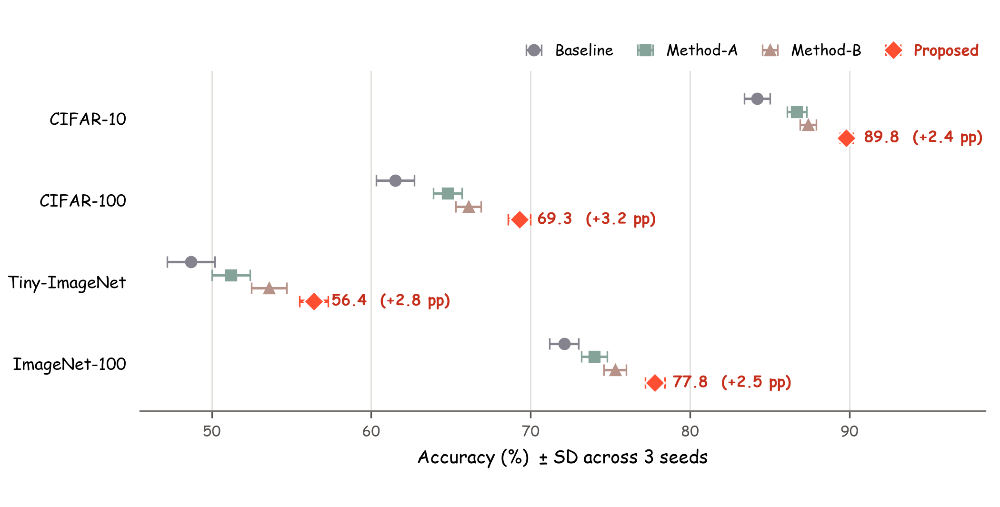
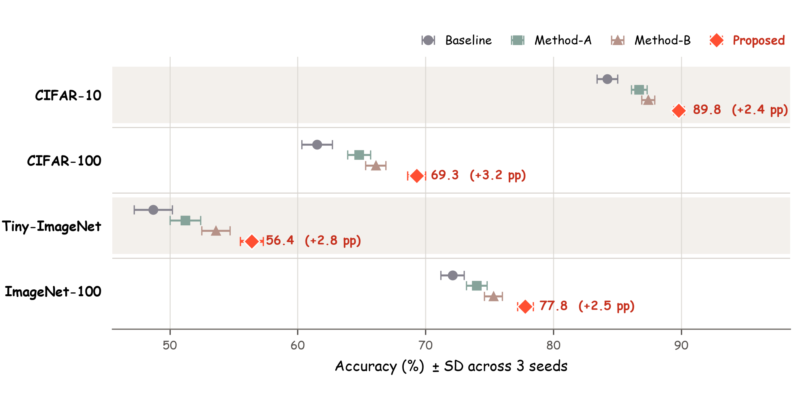
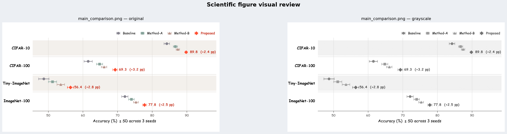

# Illustrator4Resarch

<p align="center">
  <strong>Guided agent skill for publication-ready scientific figures.</strong><br />
  Start with raw experiment data and an incomplete request; finish with a planned, rendered, inspected, reproducible figure.
</p>

<p align="center">
  
  
  
  
  
  
  
</p>

<p align="center">
  <a href="#real-world-example">Real-world Example</a> ·
  <a href="#quick-start">Quick Start</a> ·
  <a href="#agent-workflows">Agent Workflows</a> ·
  <a href="#what-it-does">What it does</a> ·
  <a href="#python-api">Python API</a> ·
  <a href="#repository-layout">Repository Layout</a>
</p>

---

## What it does

`Illustrator4Resarch` is a reusable agent skill for planning, creating, inspecting, and refining Python/Matplotlib figures for papers, theses, reports, and research slides.

Version 0.7 adds style-first orchestration. Give it raw results, a manuscript claim, an existing script/image, a visual reference, or a broad request such as “make the main paper figure.” When visual intent is incomplete, the skill first builds a Style Brief, inspects any designated reference, asks separately about unresolved venue, chart grammar, palette, typography, and layout, then asks scientific questions in the same batch. It renders only after both contracts are confirmed or delegated.

| Layer | Responsibility | Examples |
| --- | --- | --- |
| Style-first workflow | Turns incomplete inputs into a confirmed visual and scientific contract | Style Brief, reference inspection, confirmation gates, Figure Spec 1.1 |
| Palette engine | Selects colorblind-safe palettes and semantic roles | proposed method, baseline, ablation, neutral, highlight |
| Chart-style engine | Selects plotting form and publication aesthetics | Nature-like, IEEE Transactions, NeurIPS, seaborn-like, thesis clean |
| Table-style engine | Selects paper, appendix, dashboard, or print-safe table grammar | three-line table, compact table, zebra table |
| Font engine | Selects publication-safe font stacks from a controlled registry | Arial/Helvetica for formal styles; Trebuchet/Verdana-like sans fonts for cute hand-drawn styles |
| Plotting helpers | Provides reusable Matplotlib wrappers | grouped bar, trend curve, heatmap, scatter-style figures |
| Export QA | Validates and visually reviews actual outputs | DPI, signatures, blank renders, grayscale preview, collision review |

The important design choice is that workflow, chart form, palette, chart style, table style, font, and QA are separate responsibilities. A good palette cannot rescue the wrong chart, and a successful Python process does not prove that labels are readable in the exported image.

## Real-world Example

This is an actual three-turn `scientific-figure-making` session, shown in order from an incomplete request to the refined paper figure.

### Turn 1 — turn raw results into a visual contract

**User**

```text
$scientific-figure-making
请根据下面的实验结果制作论文主结果图。
重点展示 Proposed 方法整体表现更好，
但我还没有决定用什么图、配色和版式。
```

The user also pasted 16 accuracy/error results covering four methods and four datasets.

**What the skill did**

1. Read the data and identified the intended claim: `Proposed` is strongest on every dataset.
2. Recommended a horizontal grouped dot-interval chart.
3. Asked about venue, chart grammar, palette, typography, and layout.
4. Only after those style questions, asked whether `error` meant SD, SE, or another uncertainty measure.

No image was generated in this turn. That is intentional: unresolved style and scientific semantics keep formal rendering blocked.

### Turn 2 — confirm the design, render, and inspect

**User**

```text
AAAI 双栏；横向分组点区间图；
莫兰迪色对照方法 + 多巴胺色 Proposed；
Comic Sans MS；顶部右侧图例。
error 是 3 个 seeds 的标准差，允许标注相对最佳基线的提升。
```

**What the skill did**

- Recorded the confirmed choices in Figure Spec 1.1.
- Generated reproducible Python, PNG, PDF, Spec, and QA artifacts.
- Represented all 16 means and SD intervals, with gains of `+2.4`, `+3.2`, `+2.8`, and `+2.5` percentage points.
- Visually inspected the first export, found a clipped right-side annotation, expanded the plotting range, and rerendered.
- Passed all 9 deterministic export checks.

**Result after turn 2**

<p align="center">
  
</p>

This version is scientifically complete, but the next user review found that the vertically offset points were not clearly grouped by dataset.

### Turn 3 — refine the visual hierarchy without changing data

**User**

```text
$scientific-figure-making
当前图表无法确认每个点对应的 y 轴坐标是哪个数据集，请修复。
```

**What the skill did**

- Inspected the current image and plotting script before editing.
- Diagnosed the missing visual grouping between dataset rows.
- Added alternating row bands, group separators, and stronger dataset labels.
- Preserved every value, uncertainty interval, color, marker, and confirmed layout choice.
- Rerendered and repeated color/grayscale visual QA, again passing all 9 checks.

**Final result after turn 3**

<p align="center">
  
</p>

<details>
<summary><strong>Open the final color and grayscale QA preview</strong></summary>

<p align="center">
  
</p>

</details>

Final delivery: **300 DPI**, **7 × 3.55 in**, **Figure Spec valid**, **9/9 deterministic QA checks passed**, and a reproducible PNG/PDF/code/spec/QA handoff. The three turns demonstrate style-first intake, confirmation-gated rendering, actual image inspection, and data-preserving refinement.

## Quick Start

### 1. Clone the repository

```bash
git clone https://github.com/SaraiNoQ/Illustrator4Resarch.git
cd Illustrator4Resarch
python -m pip install -e .
```

### 2. Install the global skill for Codex, Claude Code, or Hermes

Install for every supported global target:

```bash
python scripts/install_global_skill.py --target all
```

Install for the original Codex + Claude Code pair only:

```bash
python scripts/install_global_skill.py --target both
```

Install for Codex only:

```bash
python scripts/install_global_skill.py --target codex
```

Install for Claude Code only:

```bash
python scripts/install_global_skill.py --target claude
```

Install for Hermes only:

```bash
python scripts/install_global_skill.py --target hermes
```

By default, Hermes installs to:

```text
~/.hermes/skills/scientific-figure-making
```

If your Hermes deployment uses a different skill root, override it explicitly:

```bash
HERMES_SKILLS_DIR=/path/to/hermes/skills python scripts/install_global_skill.py --target hermes
```

The installer is idempotent. If the target skill directory already exists, it removes the old installation first and then copies the current canonical skill package. The CLI default remains `--target both` for backward compatibility; use `--target all` when you also want Hermes.

### 3. Use it immediately

Use this test request after installation:

```text
请根据下面的数据制作论文主实验图。Fed-SOLO 是本文方法；我还没有决定期刊风格、图类型、排版、配色和字体。请先给出 Style Brief，对每个缺失维度给出推荐并让我确认；然后再列出科学问题，确认前不要正式绘图。

Datasets: GSM8K, MATH, HotpotQA, WebShop
Metric: Accuracy / Success Rate (%)
Fed-SOLO: 72.4, 41.8, 68.2, 58.0
FedAvg-LoRA: 68.1, 38.7, 64.5, 54.2
Local LoRA: 63.0, 34.9, 61.3, 49.8
FedReFT: 66.2, 37.1, 63.8, 52.5
```

The first response should ask the five unresolved style dimensions before any scientific questions and should not create formal artifacts yet. After confirmation, the agent returns a runnable script, PNG, PDF, schema 1.1 Figure Spec, QA report, and original/grayscale review preview.

If a request contains scientifically ambiguous uncertainty such as `78.4 ± 0.7`, the `±` question appears after the style section. Neither unresolved style nor unresolved uncertainty may silently pass into formal rendering.

## Agent Workflows

### Claude Code

After global installation:

```text
/scientific-figure-making
results.csv 是论文主实验结果，请你读取数据并推荐最合适的论文图。
突出 Ours；视觉方向尚未确定，请先逐项询问期刊、图形语法、配色、字体和版式。
生成后检查真实导出图片并修复问题。
```

Inside this repository, Claude Code can also discover the project wrapper at:

```text
.claude/skills/scientific-figure-making/SKILL.md
```

### Codex

After global installation:

```text
$scientific-figure-making
Use results.csv to create the main paper figure.
Ours is the proposed method. Start with a Style Brief and ask about every unresolved visual dimension before scientific clarifications.
After confirmation, create Figure Spec 1.1, render PNG/PDF, run deterministic QA,
inspect the original/grayscale preview, and revise visible defects.
```

Inside this repository, Codex can also discover the repo-scoped wrapper at:

```text
.agents/skills/scientific-figure-making/SKILL.md
```

### OpenCode

OpenCode can use the repository-scoped workflow without a separate global skill install. Start OpenCode from the repository root, then point it to the canonical skill package:

```bash
opencode
```

```text
Read AGENTS.md and use skills/scientific-figure-making/SKILL.md as the figure-generation skill.
Read results.csv and turn it into the strongest honest main-paper figure.
Use style-first guided mode because chart and style are unspecified. Ask for confirmation before rendering.
After confirmation, validate the outputs, inspect the review preview, and revise defects.
```

The OpenCode path is intentionally repository-local: it relies on `AGENTS.md` plus the canonical skill folder, so it works even when different OpenCode setups use different command/plugin conventions.

### Hermes

Install globally first:

```bash
python scripts/install_global_skill.py --target hermes
```

Then ask Hermes to use the installed skill:

```text
Use the scientific-figure-making skill from ~/.hermes/skills/scientific-figure-making/SKILL.md.
Use results.csv to make a publication-ready main-results figure.
Lead with a Style Brief and unresolved style questions, then ask scientific questions.
Render only after confirmation, then validate, visually inspect, and revise the exports.
```

For non-standard Hermes deployments, install to the directory that your Hermes instance scans:

```bash
HERMES_SKILLS_DIR=/path/to/hermes/skills python scripts/install_global_skill.py --target hermes
```

## Python API

Use the importable package when developing inside this repository:

```python
from scientific_figure_skill import (
    FigureStyle,
    apply_publication_style,
    auto_figure_design,
    select_font_family,
)

request = "二次元、可爱、手绘风格，色盲安全，多方法 grouped bar"

design = auto_figure_design(
    request,
    figure_type="grouped_bar",
    n_colors=4,
)

font_family = select_font_family(
    request=request,
    chart_style=design.chart_style,
)

style = FigureStyle(
    palette=design.palette.colors,
    color_roles=design.palette.color_roles,
    chart_style=design.chart_style,
    font_family=font_family,
)

apply_publication_style(style)
```

Preview design selection from the standalone skill package:

```bash
python skills/scientific-figure-making/scripts/preview_palette.py \
  "简洁大气，Nature科研风格" \
  --figure-type grouped_bar \
  --n-colors 5
```

The preview prints the selected palette, chart-style preset, and related design metadata.

## Available Chart-Style Presets

| Preset | Typical use |
| --- | --- |
| `publication_minimal` | General clean paper figure |
| `nature_journal` | Compact, refined journal style |
| `ieee_transactions` | Dense engineering paper figure |
| `acm_conference` | Conference-ready CS figure |
| `neurips_ml` | ML paper figure with clean grid discipline |
| `seaborn_whitegrid` | Seaborn-like whitegrid without depending on seaborn |
| `seaborn_ticks` | Seaborn-like ticks style |
| `boxed_classic` | Traditional boxed axes |
| `thesis_clean` | Thesis/report figure |
| `presentation_large` | Slides and talks |
| `cartoon_handdrawn` | Cute, hand-drawn, anime-inspired academic chart |
| `dark_presentation` | Dark background presentation figure |

## Repository Layout

```text
Illustrator4Resarch/
├── AGENTS.md
├── CLAUDE.md
├── .agents/skills/scientific-figure-making/   # Codex repo-scoped wrapper
├── .claude/skills/scientific-figure-making/   # Claude Code project wrapper
├── skills/scientific-figure-making/           # Canonical standalone skill package
│   ├── SKILL.md
│   ├── README.md
│   ├── agents/openai.yaml
│   ├── evals/evals.json
│   ├── references/
│   │   ├── api-usage.md
│   │   ├── chart-selection.md
│   │   ├── figure-spec.md
│   │   ├── font-workflow.md
│   │   ├── global-installation.md
│   │   ├── palette-workflow.md
│   │   ├── requirement-workflow.md
│   │   ├── style-intake.md
│   │   ├── style-workflow.md
│   │   ├── table-workflow.md
│   │   └── visual-qa.md
│   ├── scripts/
│   │   ├── figure_design.py
│   │   ├── figure_fonts.py
│   │   ├── figure_spec.py
│   │   ├── figure_toolkit.py
│   │   ├── preview_palette.py
│   │   ├── render_preview.py
│   │   └── validate_figure.py
│   └── examples/
├── scientific_figure_skill/                   # Importable Python implementation
├── examples/
├── docs/guided-workflow-v0.6-plan.md
├── docs/style-first-workflow-v0.7.md
├── scripts/
└── tests/
```

The canonical standalone skill package is:

```text
skills/scientific-figure-making/
```

This folder is copied into global Codex, Claude Code, and Hermes skill directories by `scripts/install_global_skill.py` and can also be packaged as a ZIP:

```bash
python scripts/package_skill.py
```

Output:

```text
dist/scientific-figure-making.zip
```
